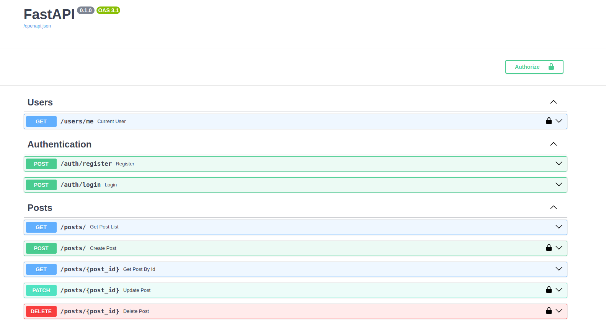

# Python RESTful Blog API

I wrote this project to explore clean architecture and put some of its principles into practice. Since I had no ideas for the project, I chose to develop a REST API for a classic blog

## Installation

To install the dependencies, run the following command:

```bash
pip install -e .
```

## Setting Environment Variables

Before running the project, make sure you have an `env.sh` file in the `scripts` directory, containing the following variables:

```bash
#! /bin/bash

export JWT_SECRET_KEY=<your_secret_key>
export JWT_ALGORITHM=<encryption_algorithm>
export JWT_EXPIRES_IN=<token_expiry_time>
export DB_HOST=<database_host>
export DB_PORT=<database_port>
export DB_USER=<database_user>
export DB_PASSWORD=<database_password>
export DB_NAME=<database_name>
export SERVER_BIND=<server_address_and_port>
```

## Running

To run the project, execute:

```bash
bash scripts/start.sh
```

## API Routes


### posts
- `GET /posts` - Get all posts
- `POST /posts` - Create a new post
- `GET /posts/{id}` - Get post by ID
- `PATCH /posts{id}` - Update a post by post ID
- `DELETE /posts/{id}` - Delete a post by post ID

### authentication
- `POST /auth/register` - Register user
- `POST /auth/login` - Login user

### users
- `GET /users/me` - Get current user

## Contribution

If you have any suggestions for improving the project, please create an Issue or Pull Request.
